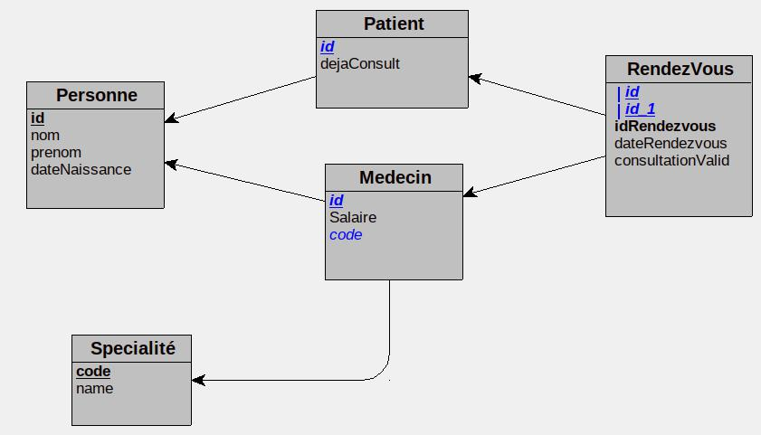

# Hopital

Projet de gestion des rendez-vous pour un hopital ; Base MariaDB/MySQL ; héritages et relations ; testé avec Postman

* Les requètes Postman sont dans : hopital.postman_collection.json. Elles sont détaillées dans ce fichier, il est possible d'ajouter patient, médecin, spécialité, rendez-vous... Pour la spécialité d'un médecin, elle peut être passée en code ou en nom. La spécialité doit être créée avant le médecin. De même le patient ou le médecin participant à un rendez-vous peut être passée en nom ou code. Il est possible de confirmer le fait qu'un rendez-vous ait eu lieu, cela passe le booléen "consultation_valid" du rendez-vous en "true" et fait du patient quelqu'un qui a déjà consulté à l'hôpital (booléen "deja consult")

* Le fichier dump-hopital-2023...sql permet de peupler rapidement la base sql, mais tout peut être fait via l'api

* Le diagramme MLD du projet : 



### MLD textuel :
```
Personne = (id COUNTER, nom VARCHAR(30), prenom VARCHAR(30), dateNaissance VARCHAR(50));
Patient = (#id, dejaConsult LOGICAL);
Specialité = (code COUNTER, name VARCHAR(20));
Medecin = (#id, Salaire VARCHAR(50), #code);
RendezVous = (#(#id), #(#id_1), idRendezvous INT, dateRendezvous VARCHAR(50), consultationValid LOGICAL);
```


